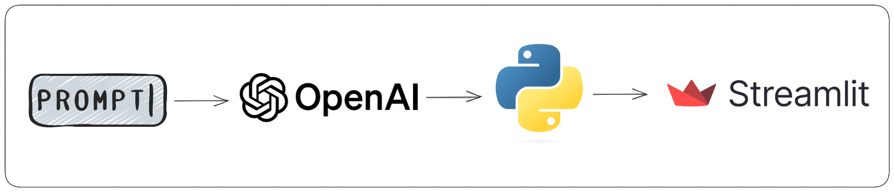

# GPTeacher 🧠

## Description
GPTeacher is an web app that uses Streamlit and OpenAI's API to create custom questionnaires to test your knowledge on the topics you wish to - maths, geography, biology, history and so on!

The web app is hosted on the Streamlit Community Cloud, and you can check it out for yourself  [here](https://gpteacher.streamlit.app/)!

Check out a quick demo below!

<p align = "center">
    
</p>


> Note: you will need an OpenAI API key in order to use the app. If you don't have one, check ou [OpenAI's page](https://platform.openai.com/account/api-keys). The pricing is very fair.

## How does it work?

1. **Prompt engineering**: create a personalized prompt that returns the questionnaire in the exact format we need
2. **Generating data**: call OpenAI's API with the prompt as input, adjusting for parameters like temperature, frequency penalty and presence penalty 
3. **Data processing**: use Python to process OpenAI's output, which includes transforming strings into Python lists and randomizing the questionnaire options
4. **Creating and deploying the app**: using Python's Streamlit library, create the web app leveraging Streamlit's functionalities like session states and inputs forms. Later, the app is deployed to the web using Streamlit Community Cloud

<p align = "center">
    
</p>

## How to deploy the web app locally

Below, I am leaving a sugestion on how to run the web app locally.

```
git clone https://github.com/ribeiroluan/gpteacher

# change to project repository
cd gpteacher

# install requirements
pip install -r requirements.txt

# use streamlit to run the app
streamlit run app.py
```

## References

- [Sven Bo (Coding is fun)](https://github.com/Sven-Bo/streamlit-quiztube)